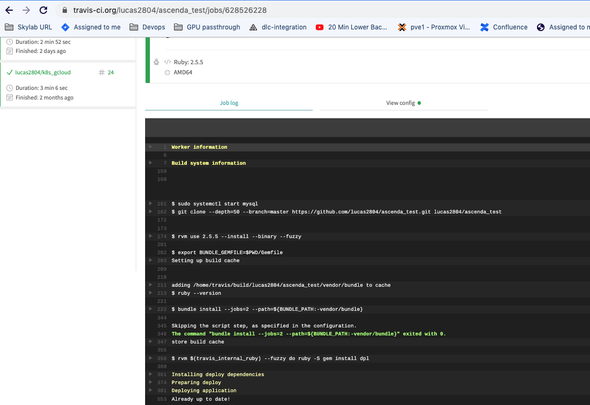

## Ascenda test

- Production link: **https://ascenda.herokuapp.com/hotels**

### I - Set up project at localhost

```bash
git clone git@github.com:lucas2804/ascenda_test.git
cd ascenda_test
bundle install

mysql.server start
rake db:setup
rake db:migrate
rspec

curl http://localhost:3000/hotels/sync_data
curl http://localhost:3000/hotels
curl http://localhost:3000/?hotel_ids[]=iJhz&destination_ids[]=5432
```

#### 1) Sync hotel data endpoint

```bash
curl http://localhost:3000/hotels/sync_data
```

```json
{"message":"Sync data successfully from Supplier1 2 3","total_hotels":3}
```

#### 2) Search hotels depends on hotel_ids and destination_ids

```bash
curl http://localhost:3000/?hotel_ids[]=iJhz&destination_ids[]=5432
```

```mysql
SELECT `hotels`.* FROM `hotels` WHERE `hotels`.`hotel_id` = 'iJhz';

SELECT `hotels`.* FROM `hotels` WHERE `hotels`.`hotel_id` = 'iJhz' AND `hotels`.`hotel_id` = '5432' AND `hotels`.`hotel_id` = '5432' AND `hotels`.`hotel_id` = '5432';
```

#### 3) Get hotel data endpoint

```bash
curl http://localhost:3000/hotels
```

```json
[
  {
    "id": "iJhz",
    "destination_id": 5432,
    "name": "Beach Villas Singapore",
    "location": {
      "lat": 1.26475,
      "lng": 103.824,
      "address": "8 Sentosa Gateway, Beach Villas, 098269",
      "city": "Singapore",
      "country": "Singapore"
    },
    "description": "This 5 star hotel is located on the coastline of Singapore.",
    "amenities": {
      "general": [
        {
          "name": "pool",
          "category": "general"
        }
      ],
      "room": [
        {
          "name": "pool",
          "category": "general"
        },
        {
          "name": "tub",
          "category": "general"
        }
      ]
    },
    "images": {
      "rooms": [
        {
          "link": "https://d2ey9sqrvkqdfs.cloudfront.net/0qZF/2.jpg",
          "description": "Double room"
        },
        {
          "link": "https://d2ey9sqrvkqdfs.cloudfront.net/0qZF/3.jpg",
          "description": "Double room"
        },
        {
          "link": "https://d2ey9sqrvkqdfs.cloudfront.net/0qZF/4.jpg",
          "description": "Bathroom"
        }
      ],
      "site": [
        {
          "link": "https://d2ey9sqrvkqdfs.cloudfront.net/0qZF/1.jpg",
          "description": "Front"
        }
      ],
      "amenities": [
        {
          "link": "https://d2ey9sqrvkqdfs.cloudfront.net/0qZF/0.jpg",
          "description": "RWS"
        },
        {
          "link": "https://d2ey9sqrvkqdfs.cloudfront.net/0qZF/6.jpg",
          "description": "Sentosa Gateway"
        }
      ]
    },
    "booking_conditions": [
      "Pets are not allowed.",
      "WiFi is available in all areas and is free of charge.",
      "Free private parking is possible on site (reservation is not needed).",
    ]
  }
]
```

### II - CI/CD with Travis and Heroku




### III - Services & Rspec

```ruby
# spec/services/sanitizing_hotel/supplier1_spec.rb
# spec/services/sanitizing_hotel/supplier2_spec.rb
# spec/services/sanitizing_hotel/supplier3_spec.rb
# spec/services/sanitizing_hotel/base_spec.rb

# base_spec.rb  example

RSpec.describe SanitizingHotel::Base do
  let(:service) { SanitizingHotel::Base.new }
  let(:general) { Amenity.categories[:general] }
  let(:room) { Amenity.categories[:room] }
  let(:fake_response) { '{}' }

  describe '#update_hotel_amenities' do
    let(:hotel) { create(:hotel) }
    let(:amenities) { create_list(:amenity, 2) }
    it 'should create hotel with relate amenities' do
      service.send(:update_hotel_amenities, hotel, amenities)

      hotel = Hotel.first
      expect(hotel.amenities.size).to eq(2)
      expect(HotelsAmenity.count).to eq(2)
    end
  end

  describe '#update_amenities!' do
    it 'should change camelcase to normal words and strip' do
      amenity_params = [' DryCleaning ', '  BusinessCenter  ']
      service.send(:update_sanitized_amenities!, amenity_params, general)
      expect(Amenity.first.name).to eq('dry cleaning')
      expect(Amenity.last.name).to eq('business center')
    end

    it 'should not sanitize CONCATENATE_WORDS as WiFi' do
      amenity_params = [' WiFi ']
      service.send(:update_sanitized_amenities!, amenity_params, general)
      expect(Amenity.first.name).to eq('wifi')
    end

    it 'should check each word then ignore if in CONCATENATE_WORDS' do
      amenity_params = ['AzzBbb WiFi C']
      service.send(:update_sanitized_amenities!, amenity_params, general)
      expect(Amenity.first.name).to eq('azz bbb wifi c')
    end

    it 'should create amenity with category general' do
      amenity_params = ['AzzBbb WiFi C']
      service.send(:update_sanitized_amenities!, amenity_params, general)
      expect(Amenity.first.category).to eq('general')
    end
  end
end
 
```
